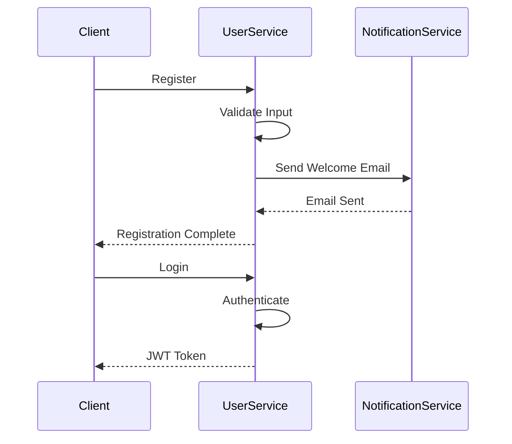
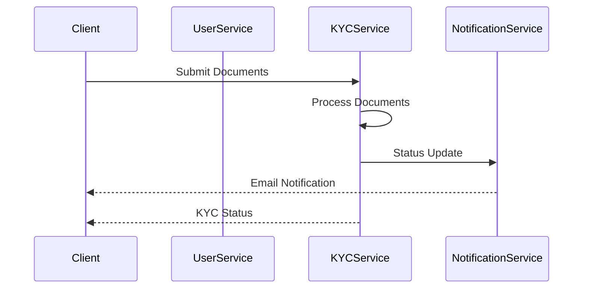
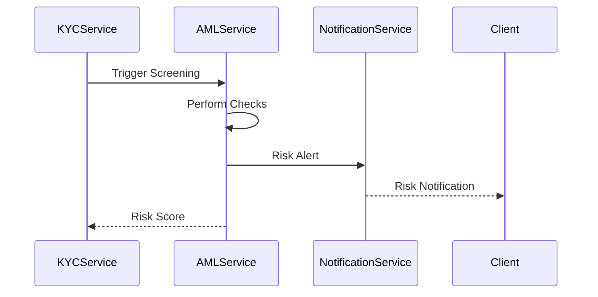
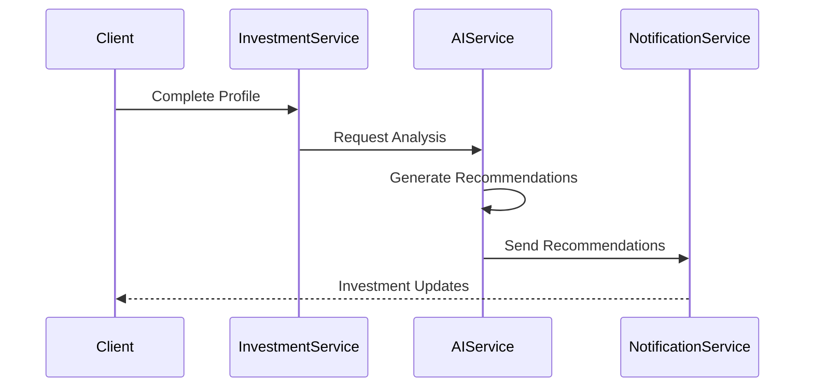

# SparkFund Service Workflow Documentation

## Overview
This document outlines the complete user journey and service interactions in the SparkFund platform, from user registration to investment recommendations.

## User Journey Flow

### 1. User Registration & Authentication
1. User registers through the User Service
   - Validates email and password
   - Creates user profile
   - Sends welcome email via Notification Service
2. User logs in
   - Authenticates credentials
   - Receives JWT token
   - Creates session
3. User completes profile
   - Updates personal information
   - Sets notification preferences
   - Configures security settings

### 2. KYC Verification
1. User initiates KYC process
   - Submits identity documents
   - Provides personal information
   - Uploads proof of address
2. KYC Service processes documents
   - Validates document authenticity
   - Performs OCR and data extraction
   - Calculates risk score
3. Compliance team reviews
   - Approves/rejects KYC
   - Requests additional information if needed
4. User receives status updates
   - Email notifications for status changes
   - In-app notifications for actions required

### 3. AML Screening
1. System performs initial AML check
   - Screens against watchlists
   - Checks for PEP status
   - Validates against sanctions lists
2. Risk assessment
   - Calculates AML risk score
   - Determines monitoring level
   - Sets transaction limits
3. Ongoing monitoring
   - Tracks transaction patterns
   - Monitors for suspicious activity
   - Updates risk scores

### 4. Investment Process
1. User completes investment profile
   - Risk tolerance assessment
   - Investment goals
   - Time horizon
2. AI-powered analysis
   - Analyzes market conditions
   - Evaluates user profile
   - Generates personalized recommendations
3. Portfolio management
   - Creates investment portfolio
   - Sets rebalancing rules
   - Monitors performance

## Service Interactions

### Authentication Flow

### KYC Flow

### AML Flow

### Investment Flow

## Service Dependencies

### User Service Dependencies
- Notification Service: For sending emails and notifications
- KYC Service: For user verification status
- AML Service: For risk assessment

### KYC Service Dependencies
- User Service: For user information
- Notification Service: For status updates
- AML Service: For initial screening

### AML Service Dependencies
- KYC Service: For user verification
- Notification Service: For risk alerts
- Investment Service: For transaction monitoring

### Investment Service Dependencies
- User Service: For user profile
- KYC Service: For verification status
- AML Service: For risk assessment
- AI Service: For recommendations
- Notification Service: For updates

## Security Considerations

### Authentication
- JWT-based authentication
- Multi-factor authentication
- Session management
- Rate limiting

### Data Protection
- Encryption at rest
- Encryption in transit
- PII data handling
- Audit logging

### Compliance
- GDPR compliance
- Financial regulations
- Data retention policies
- Access controls

## Monitoring and Metrics

### System Health
- Service uptime
- Response times
- Error rates
- Resource utilization

### Business Metrics
- User registration rate
- KYC completion rate
- AML risk distribution
- Investment performance

## Error Handling

### Graceful Degradation
- Service fallbacks
- Circuit breakers
- Retry mechanisms
- Error notifications

### Recovery Procedures
- Data consistency checks
- State reconciliation
- Manual intervention process
- Incident response

## Deployment Considerations

### Environment Setup
- Development
- Staging
- Production
- Disaster recovery

### Scaling Strategy
- Horizontal scaling
- Load balancing
- Database sharding
- Cache management

## Future Enhancements

### Planned Features
- Enhanced AI recommendations
- Advanced risk scoring
- Real-time monitoring
- Automated compliance

### Integration Opportunities
- Additional payment providers
- External data sources
- Third-party services
- Regulatory reporting 